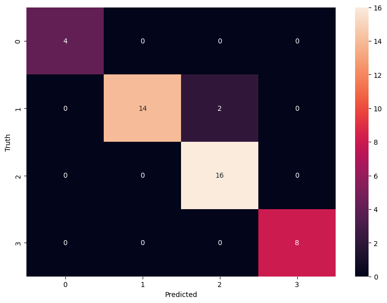

# Data-Science-Portfolio

# [Project 1: Washignton House Prices Prediction: Project Overview](https://github.com/kamlishgoswami/Washington-House-Prices-Prediction/tree/main)

• The purpose of my project was to analyze a real estate property dataset from Washington, USA and provide valuable insights for the real estate market.

• Downloaded real estate property dataset from Kaggle for Washington, USA.

• Conducted comprehensive data preprocessing, including handling missing values, outliers, and encoding categorical variables.

• Performed feature engineering to create new meaningful features.

• Conducted exploratory data analysis (EDA) to gain insights into data distribution and relationships.

• Utilized GridSearchCV for thorough model optimization.

• Achieved 67% accuracy using Lasso as the best-performing model.

• Developed a client-facing API using FastAPI for real estate price predictions.

• Created a responsive website using HTML, CSS, Bootstrap, and JavaScript to enhance user experience and interact with the API.

• Deployed the model, API, and website to AWS for accessibility and scalability.

Technologies Used: Python, Numpy, Pandas Matplotlib, Seaborn, scikit-learn, Joblib, JSON, FastAPI, AWS, HTML,CSS,Bootstrap and JavaScript. 

[AWS Link](http://ec2-54-242-12-7.compute-1.amazonaws.com/)

# [Project 2: Image Classification: Project Overview](https://github.com/kamlishgoswami/Image-Classification-)

• The purpose of this personal data science project was to develop an image classification system capable of accurately identifying and  categorizing facial features. 

• Collected a diverse dataset of facial images through web scraping from Google

• Performed efficient data preprocessing using OpenCV, including face and eyes detection for extracting and cropping facial regions from the images.

• Used Wavelet transform for feature engineering, capturing important image details.

• Conducted thorough model optimization using GridSearchCV to find the best performing classifier.

• Achieved 95.4% accuracy using Support Vector Machine (SVM) as the best-performing classifier.

• Effectively communicated findings through comprehensive reports, including precision, recall, and F1-score metrics.

Technologies used: Python, Numpy, Pandas Matplotlib, Seaborn, scikit-learn, OpenCV, PyWavelets, Joblib, JSON, Selenium

 

 

# [Project 3: Road Accident Insights: Project Overview](https://github.com/kamlishgoswami/Road-Accident-Insights-Tableau)

• Developed a dynamic dashboard in Tableau to unlock road accident insights that are not visible.

• Utilized SQL to analyze accident data and extract valuable insights for data-driven decision-making.

• Created interactive charts, graphs, and maps within the Tableau dashboard to visualize accident data effectively.

• Empowered users to explore accident trends by various dimensions, including severity, location, vehicle type, road type, and weather condition.

• Implemented the dashboard as a decision support tool to aid in reducing casualties and improving road safety.

• Demonstrated expertise in data visualization and analysis, utilizing Tableau and SQL to extract actionable insights from complex accident data.

Technologies Used: SQL, Tableau

[Dashboard Link](https://public.tableau.com/app/profile/kamlish.goswami/viz/UKAccidentDashboard_16857232228310/Dashboard1?publish=yes)

